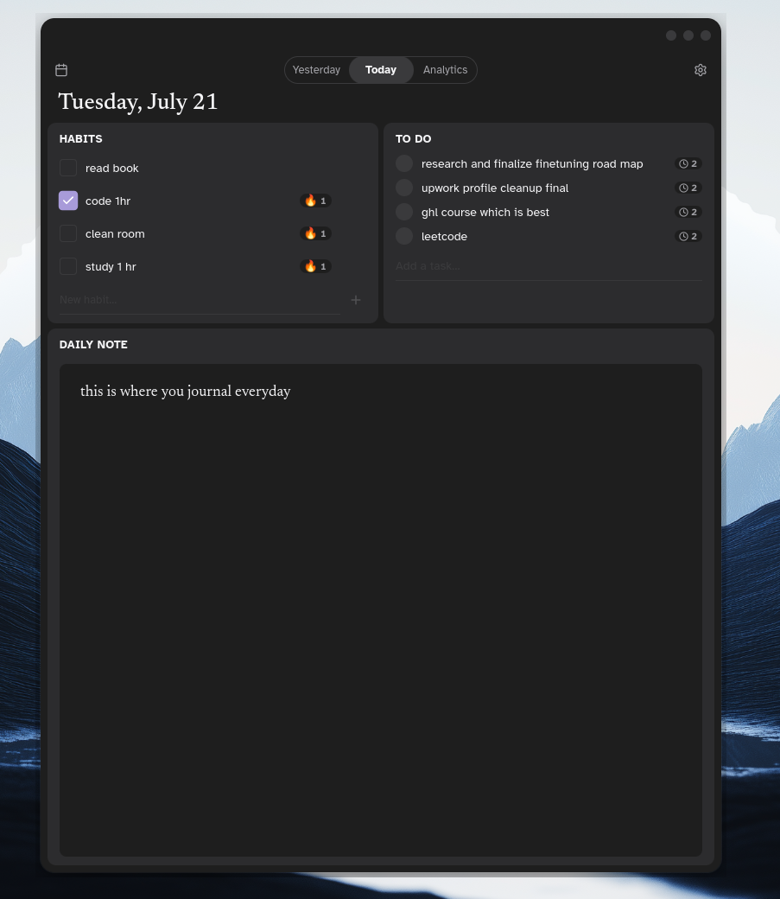
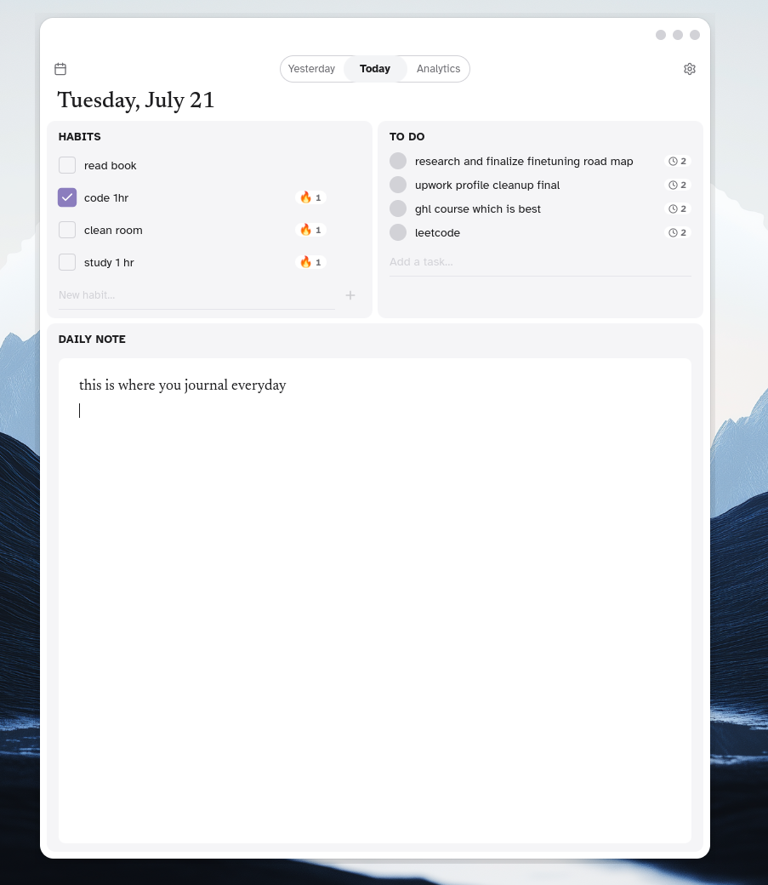

# Diary

A minimal, cozy desktop app for daily journaling and habit tracking.  
Single white background. Warm, calm, book-like — not a productivity dashboard.

<picture>
  <source media="(prefers-color-scheme: light)" srcset="new_light.png">
  
</picture>

## Features

- **Today** — write today's journal entry on the left 70%, tick off daily habits on the right 30%.
- **Monthly** (Phase 2 stub) — placeholder for the future calendar + analytics view.
- **To-do** — quick tasks for today; swipe-style completion animation.
- **Offline-first** — bundled fonts, local JSON store via Tauri plugin, no network required.
- **Plain-text journal** — CodeMirror 6 with undo history, search, and line wrapping. Future-proofed for vim motions and bullet lists.
- **Dark / Light mode** — follows the OS preference automatically.
- **macOS traffic-light window controls** (or Windows/Linux dots) with drag regions for a native feel.

## Screenshots

| Light mode                                        | Dark mode                                       |
| ------------------------------------------------- | ----------------------------------------------- |
|                        |                       |

## Tech stack

| Concern            | Choice                                                   |
| ------------------ | -------------------------------------------------------- |
| Runtime / shell    | Tauri v2                                                 |
| Frontend           | SvelteKit 2 + Svelte 5 (runes mode) + TypeScript (strict) |
| Adapter            | `@sveltejs/adapter-static` — SPA mode                    |
| Package manager    | bun                                                      |
| Styling            | Tailwind CSS v4                                          |
| Editor             | CodeMirror 6 — plain text                                |
| Font (journal)     | Newsreader (serif) 17px / 1.7                            |
| Font (UI)          | Atkinson Hyperlegible (sans)                             |
| State              | Svelte 5 runes + component stores                        |
| Persistence        | `@tauri-apps/plugin-store` (JSON file)                   |
| Dates              | date-fns                                                 |
| Icons              | lucide-svelte                                            |

## Getting started

```bash
bun install
bun run tauri dev
```

### Common commands

```bash
bun run dev           # Vite dev server (port 1420)
bun run tauri dev     # Full desktop dev shell
bun run build         # Production web build → ./build
bun run tauri build   # Build + bundle the desktop app
bun run check         # svelte-kit sync + svelte-check
```

## Project layout

```
src/
  routes/
    +page.svelte              # Today view (journal + sidebar)
    monthly/+page.svelte      # Monthly view stub
  lib/
    components/
      Editor.svelte           # CodeMirror wrapper
      HabitList.svelte        # Habit checkboxes
      HabitRow.svelte         # Single habit row
      HabitAddForm.svelte     # Add new habit
      TodoList.svelte         # To-do list
      TodoRow.svelte          # Single to-do item
      ViewSwitch.svelte       # Today / Monthly pill toggle
      TitleBar.svelte         # Custom window controls
    editor/
      extensions.ts           # CM6 extension preset
      theme.ts                # CM6 custom theme
    stores/
      journal.svelte.ts       # Journal text (date-keyed)
      habits.svelte.ts        # Habit definitions + checks
      todos.svelte.ts         # To-do items
      view.svelte.ts          # Active view ('today' | 'monthly')
src-tauri/
  src/lib.rs                  # Tauri commands (empty in Phase 1)
  tauri.conf.json             # Window, build, bundle config
```

## Design system

- **Paper** — solid `#ffffff` (light) / `#1e1e1e` (dark), no noise, no gradients.
- **Ink** — Apple-style `#1d1d1f` / `#f5f5f7` with soft and faint variants.
- **Accent** — muted purple (`#8b7dbe` / `#a89bd9`) used only on the view toggle and checked boxes.
- **Typographic rhythm** — Newsreader for the journal body, Atkinson Hyperlegible for UI labels.
- **Motion** — spring-eased micro-interactions on checkboxes, to-do circles, page transitions.

## License

MIT
